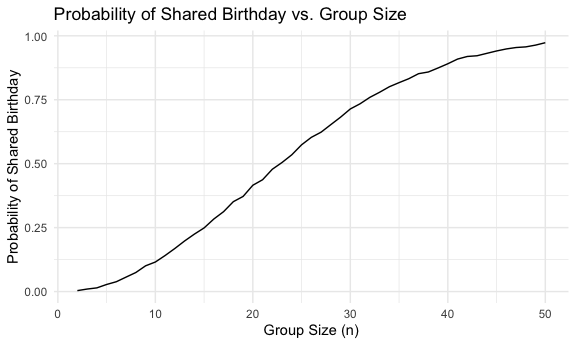
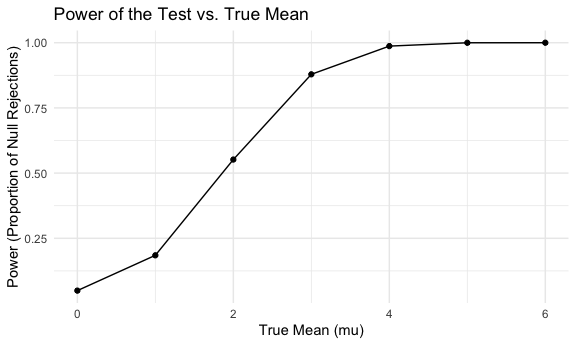
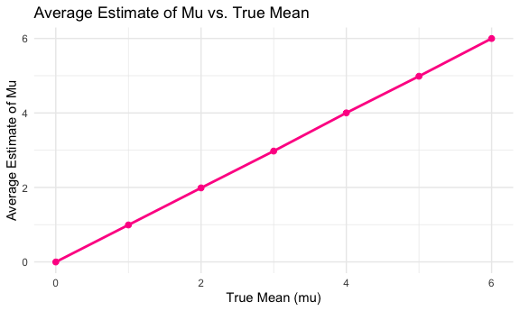
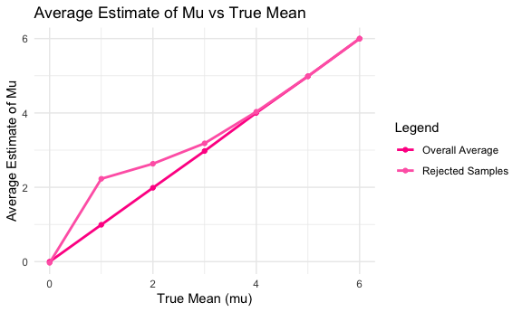
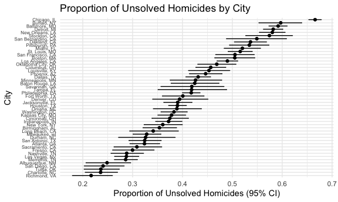

Homework 5
================
Samina Rashiq
2024-11-15

## Problem 1

``` r
#Set seed for reproducibility
set.seed(4200)

# Create birthday simulation function
bday_sim = function(n) {
  bdays = sample(1:365, size = n, replace = TRUE)
  duplicate = length(unique(bdays)) < n
  return(duplicate)
}

# Run simulation from for group sizes between 2-50 10000 times
sim_res = 
  expand_grid(
    n = 2:50,
    iter = 1:10000
  ) |> 
  mutate(res = map_lgl(n, bday_sim)) |> 
  group_by(n) |> 
  summarize(prob = mean(res))

# Plot probability as a function of group size
sim_res |> 
  ggplot(aes(x = n, y = prob)) + 
  geom_line() +
  labs(
    title = "Probability of Shared Birthday vs. Group Size",
    x = "Group Size (n)",
    y = "Probability of Shared Birthday"
  ) +
  theme_minimal()
```



As group size increases, the probability that two people in the group
share the same birthday increases as well.

## Problem 2

``` r
# Set seed for reproducibility
set.seed(1738)

# Set design elements
n <- 30       # Sample size
std_dev <- 5  # Standard deviation
hypotheses <- c(0, 1, 2, 3, 4, 5, 6)  # Hypothesized means

# Generate datasets for each true mean
datasets <- expand_grid(
  dataset_id = 1:5000,
  true_mean = hypotheses
) %>%
  mutate(data = map(true_mean, ~ rnorm(n, mean = .x, sd = std_dev)))

# Perform t-tests and compute sample means and p-values
t_test_results <- datasets %>%
  mutate(
    mu_hat = map_dbl(data, mean),                            
    p_value = map_dbl(data, ~ t.test(.x, mu = 0)$p.value)
  )
```

#### Power Plot

``` r
# Calculate power for each true mean
power_results <- t_test_results %>%
  group_by(true_mean) %>%
  summarize(power = mean(p_value < 0.05), .groups = "drop")  # Proportion of rejections

# Plot power versus true mean
plot_power <- ggplot(power_results, aes(x = true_mean, y = power)) +
  geom_line() +
  geom_point() +
  labs(
    title = "Power of the Test vs. True Mean",
    x = "True Mean (mu)",
    y = "Power (Proportion of Null Rejections)"
  ) +
  theme_minimal()

print(plot_power)
```



#### Average Estimate vs. True Mean Plot

``` r
# Calculate average mu_hat for all datasets
average_mu_results <- t_test_results %>%
  group_by(true_mean) %>%
  summarize(avg_mu_hat = mean(mu_hat), .groups = "drop")

# Calculate average mu_hat for rejected samples only
average_mu_rejected <- t_test_results %>%
  filter(p_value < 0.05) %>%
  group_by(true_mean) %>%
  summarize(avg_mu_rejected = mean(mu_hat), .groups = "drop")

# Combine overall and rejected averages for combined plot
combined_results <- average_mu_results %>%
  left_join(average_mu_rejected, by = "true_mean")


# Plot average mu_hat vs true mean
plot_avg_mu <- ggplot(average_mu_results, aes(x = true_mean, y = avg_mu_hat)) +
  geom_line(color = "deeppink", size = 1) +
  geom_point(color = "deeppink", size = 2) +
  labs(
    title = "Average Estimate of Mu vs. True Mean",
    x = "True Mean (mu)",
    y = "Average Estimate of Mu"
  ) +
  theme_minimal()

print(plot_avg_mu)
```



``` r
# Plot overall average vs rejected sample average
plot_combined <- ggplot(combined_results, aes(x = true_mean)) +
  geom_line(aes(y = avg_mu_hat, color = "Overall Average"), size = 1) +
  geom_point(aes(y = avg_mu_hat, color = "Overall Average")) +
  geom_line(aes(y = avg_mu_rejected, color = "Rejected Samples"), size = 1) +
  geom_point(aes(y = avg_mu_rejected, color = "Rejected Samples")) +
  scale_color_manual(values = c("Overall Average" = "deeppink", "Rejected Samples" = "hotpink")) +
  labs(
    title = "Average Estimate of Mu vs True Mean",
    x = "True Mean (mu)",
    y = "Average Estimate of Mu",
    color = "Legend"
  ) +
  theme_minimal()

print(plot_combined)
```



No, the sample average of mu-hat from rejected tests is not
approximately equal to the true value of mu, especially when mu is
small. This is because we only reject the null hypothesis when the
estimate mu-hat is more extreme, which leads to a higher average for
rejected samples.

However, as mu gets larger, the rejected-samples average approaches the
true value because we are rejecting the null hypothesis more frequently.
This means we’re including nearly all samples, not just the extreme
ones, which reduces the bias.

## Problem 3

``` r
homicide_dta <- 
  read_csv("homicide-data.csv") 
```

    ## Rows: 52179 Columns: 12
    ## ── Column specification ────────────────────────────────────────────────────────
    ## Delimiter: ","
    ## chr (9): uid, victim_last, victim_first, victim_race, victim_age, victim_sex...
    ## dbl (3): reported_date, lat, lon
    ## 
    ## ℹ Use `spec()` to retrieve the full column specification for this data.
    ## ℹ Specify the column types or set `show_col_types = FALSE` to quiet this message.

``` r
# Create city_state variable and convert reported_date
homicide_dta <- homicide_dta |>
  mutate(city_state = str_c(city, ", ", state)) |>
  mutate(reported_date = as.character(reported_date)) |>
  mutate(reported_date = as.Date(reported_date, format = "%Y%m%d"))

# Reassign Tulsa, AL (does not exist) to Tulsa, OK
homicide_dta <- homicide_dta |> 
  mutate(
    city_state = case_when(
      city_state == "Tulsa, AL" ~ "Tulsa, OK", 
      TRUE ~ city_state
    )
  )

# Summarize homicides
summary <- homicide_dta |>
  group_by(city_state) |>
  summarise(
    total_homicides = n(),
    unsolved_homicides = sum(disposition %in% c("Closed without arrest", "Open/No arrest")),
    solved_homicides = sum(disposition == "Closed by arrest")
  )

# View summary
print(summary)
```

    ## # A tibble: 50 × 4
    ##    city_state      total_homicides unsolved_homicides solved_homicides
    ##    <chr>                     <int>              <int>            <int>
    ##  1 Albuquerque, NM             378                146              232
    ##  2 Atlanta, GA                 973                373              600
    ##  3 Baltimore, MD              2827               1825             1002
    ##  4 Baton Rouge, LA             424                196              228
    ##  5 Birmingham, AL              800                347              453
    ##  6 Boston, MA                  614                310              304
    ##  7 Buffalo, NY                 521                319              202
    ##  8 Charlotte, NC               687                206              481
    ##  9 Chicago, IL                5535               4073             1462
    ## 10 Cincinnati, OH              694                309              385
    ## # ℹ 40 more rows

This publicly-available dataset from the Washington Post contains
homicide data from cities in the US. The dataset contains 52179 homicide
cases and has 13 columns, with variables including victim name, age,
race, sex, and disposition of the case. It contains data from 50 cities.

``` r
# Filter for Baltimore cases
baltimore <- homicide_dta |> 
  filter(city_state == "Baltimore, MD")

# Count number unsolved/total homicides
total_cases <- nrow(baltimore)
unsolved_cases <- baltimore |> 
  filter(disposition == "Open/No arrest") |>  
  nrow()

# Perform the prop test
baltimore_prop_test <- prop.test(
  x = unsolved_cases, 
  n = total_cases,
  alternative = "two.sided"
)

# Tidy result and extract proportion and CI's
baltimore_prop_test_summary <- baltimore_prop_test |> 
  tidy() |> 
  select(estimate, conf.low, conf.high)

print(baltimore_prop_test_summary)
```

    ## # A tibble: 1 × 3
    ##   estimate conf.low conf.high
    ##      <dbl>    <dbl>     <dbl>
    ## 1    0.592    0.573     0.610

``` r
# Summarize total/unsolved cases by city
city_data <- homicide_dta |> 
  group_by(city_state) |> 
  summarise(
    total_cases = n(),
    unsolved_cases = sum(disposition == "Open/No arrest"),
    .groups = "drop"
  )

# Run prop.test for each city
city_results <- city_data |> 
  mutate(
    prop_test_result = map2(
      unsolved_cases, 
      total_cases, 
      ~ prop.test(x = .x, n = .y, alternative = "two.sided")
    ),
    tidy_result = map(prop_test_result, tidy)
  ) |> 
  unnest(tidy_result) |>
  select(city_state, estimate, conf.low, conf.high)

# View results
city_results
```

    ## # A tibble: 50 × 4
    ##    city_state      estimate conf.low conf.high
    ##    <chr>              <dbl>    <dbl>     <dbl>
    ##  1 Albuquerque, NM    0.249    0.207     0.296
    ##  2 Atlanta, GA        0.324    0.295     0.354
    ##  3 Baltimore, MD      0.592    0.573     0.610
    ##  4 Baton Rouge, LA    0.425    0.377     0.473
    ##  5 Birmingham, AL     0.354    0.321     0.388
    ##  6 Boston, MA         0.505    0.465     0.545
    ##  7 Buffalo, NY        0.597    0.553     0.639
    ##  8 Charlotte, NC      0.236    0.205     0.270
    ##  9 Chicago, IL        0.666    0.653     0.678
    ## 10 Cincinnati, OH     0.375    0.339     0.412
    ## # ℹ 40 more rows

#### Proportion of Unsolved Homicides by City Plot

``` r
# Plot the results
city_results |> 
  mutate(city_state = reorder(city_state, estimate)) |>
  ggplot(aes(x = city_state, y = estimate)) +
  geom_point() +
  geom_errorbar(aes(ymin = conf.low, ymax = conf.high), width = 0.2) +
  coord_flip() +
  labs(
    title = "Proportion of Unsolved Homicides by City",
    x = "City",
    y = "Proportion of Unsolved Homicides (95% CI)",
  ) +
  theme_minimal() +
  theme(
    axis.text.y = element_text(size = 6)  # Adjust text size for city labels
  )
```


